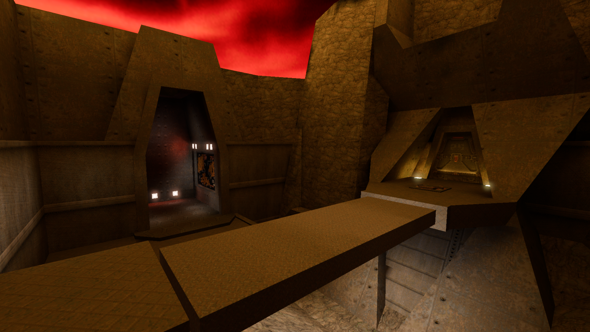
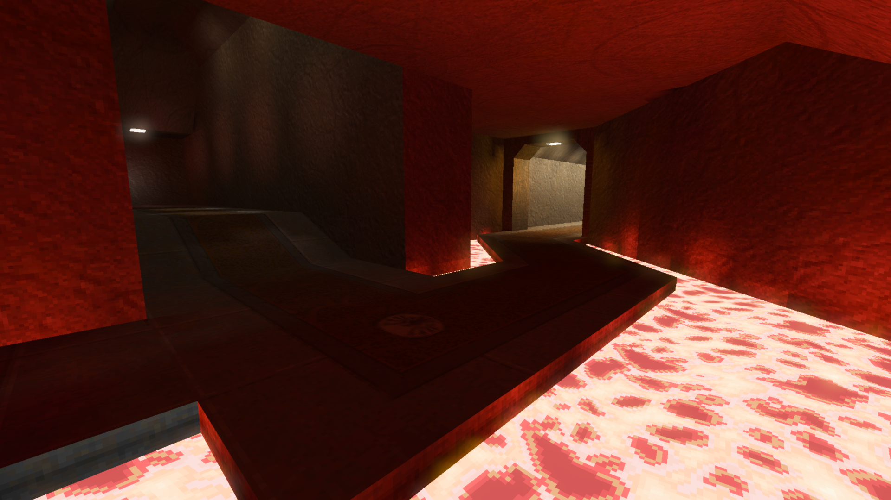

# Göld - Löve but for Goldsrc

This is designed to be a game engine for hacking together 3D games using old tech. It's based on the
simple mental model of PyGame or Löve, but for Goldsrc/Quake-era tech. My ultimate goal is to have a
simple engine which can do basically everything that many simplistic 3D games will need, without
making an attempt at being too general. I can currently load Quake 2 maps (although not Quake/Goldsrc
maps yet), render them with proper BSP culling and frustrum culling, and load and render HL1 models
(as you can see in the 4th image). Models are lit dynamically using a really simple instanced
lighting system - Quake 2 maps tend to have a _lot_ of lights though, so we should probably work out a 
better way to handle lighting down the line so we don't have to do so many expensive calculations.

 

 


## How to use

Extract Quake 2's .pak files into a folder called `data` in the working directory that you'll be
executing the program in (so probably the project root, if you're executing with `cargo run`). You
can do this with a tool like [pakextract](https://github.com/yquake2/pakextract). I don't parse
`.wal` textures, so you'll have to bulk-convert any textures stored as `.wal` to `.tga`, `.png`,
`.gif` or suchlike. I'm just using the `image` library for my image parsing, since Goldsrc uses
`.png` and `.tga` textures anyway and the game that I have in mind as an "end goal" for this project
primarily reuses Goldsrc assets. To convert `.wal` to `.tga`, I would like to recommend Wally since
everyone else online does, but I've found that it consistently crashes when batch processing images
under Wine, and so the best way I've found to do the conversion is by a simple Python script using
the Pillow library:

```python
from PIL import WalImageFile

for vals in os.walk("."):
    root, dirs, files = vals
    for file in files:
        pre, ext = os.path.splitext(file)
        try:
            WalImageFile.open(root + "/" + file).save(root + "/" + pre + ".png")
        except:
            pass
```

If you don't do this, you'll see something which I'm sure will be familiar to many modders and
tinkerers of this era of games:


