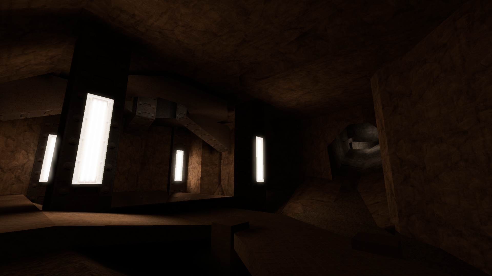
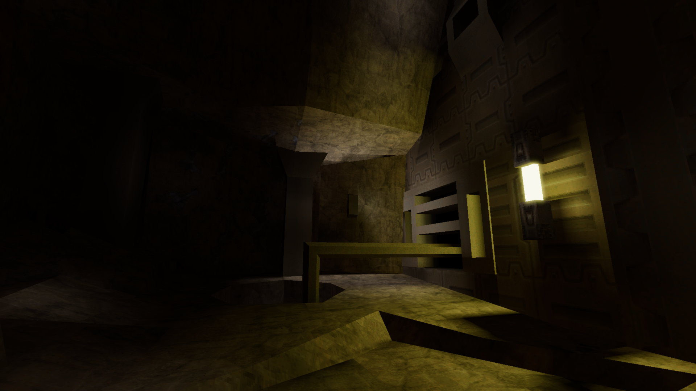

# Göld - Löve but for Goldsrc

This is designed to be a game engine for hacking together 3D games using old tech. It's based on the
simple mental model of PyGame or Löve, but for Goldsrc/Quake-era tech. My ultimate goal is to have a
simple engine which can do basically everything that many simplistic 3D games will need, without
making an attempt at being too general. I can currently load Quake 2 maps (although not Quake/Goldsrc
maps yet), render them with proper BSP culling and frustrum culling, and load and render HL1 models.
Many Quake 2 maps look better in Göld than in the original game, since Göld renders in HDR and applies
the filmic ACES tonemapping algorithm, extended with crosstalk (desaturating bright colours) and bloom
implemented with Kawase blur. Eventually I'll write a post up explaining why HDR and tonemapping is important,
and comparing XYZ tonemapping to tonemapping componentwise in RGB (which is how many HDR renderers handle
it, requiring an additional colour-correction step). In an ideal world I'd do tonemapping using OpenColorIO
so that I can, for example, use Filmic Blender tonemapping instead of hardcoding ACES, but it's not particularly
pressing.

Renderer settings can be tweaked by pressing backtick to access the debug menu.

 

 





## Roadmap/future features

The next feature I want to implement is animation. It's partially completed, but I can't load the
animations from the `.mdl` file yet. My next task will be extending my BSP loader to support loading
Half-Life 1 maps. In an ideal world I'd also be able to load Quake 1 and Quake 3 maps too, and even
other forms of BSP, but that's much more of a stretch goal than anything else since Half-Life 1 is
the game that I want to steal assets from the most. After that my next task is integrating a 
scripting layer and adding some simple collision and other game-specific elements. As a part of
implementing scripting and collision I want to convert this to use an ECS. I'm considering rewriting
this to use Bevy, which would make integrating scripting easier, but I'm not yet sure whether that
would work well as I've written a Quake 3 map renderer on Amethyst which was a horrible experience,
as the asset loading system and renderer were almost unusable. Admittedly since this is a standalone
project and not a library I would be completely able to throw out the Bevy renderer (and I would
probably have to considering I've written my own that's tailored perfectly for what I need to render),
but if the asset loader isn't usable that's more of an issue. It's something I'll have to tackle once
animation is implemented.

My ultimate goal is to make a simple racing game or platformer using this engine - if I have the time,
both. I don't really intend to release a full game using this, but I think it'd be good to try to make
two quite-different games as a test for how easy it is to make something different. I might try to
reimplement simple versions of some classic Quake mods like Q3Rally or FreeCS, or even allow using
QuakeC as the scripting language directly, except with a superset of the functions available (similar
to how FTEQuake works). The first language I want to use is Lua though, so if I do implement QuakeC
scripting it'll be possible to seamlessly use Lua and QuakeC scripts in the same project.

I do _not_ intend for this to be a full Quake series source port like Darkplaces or FTEQuake, but
instead to be a Quake-like game engine that implements features in a Quake-compatible way where
convenient. However, I am considering how possible it would be for me to compile the Half-Life or
Xash client/server source code to WebAssembly and run it, as Half-Life separates the game (which
is a `.dll`) from the engine (which is a `.exe`). Whether this is worth the significant effort that
would be required is up for debate. It would be cool to get Goldsrc games working on this though,
since I think They Hunger especially would be great to see rendered in a modern engine with modern
conveniences.

## How to use

Extract Quake 2's .pak files into a folder called `data` in the working directory that you'll be
executing the program in (so probably the project root, if you're executing with `cargo run`). You
can do this with a tool like [pakextract](https://github.com/yquake2/pakextract). I don't parse
`.wal` textures, so you'll have to bulk-convert any textures stored as `.wal` to `.tga`, `.png`,
`.gif` or suchlike. I'm just using the `image` library for my image parsing, since Goldsrc uses
`.png` and `.tga` textures anyway and the game that I have in mind as an "end goal" for this project
primarily reuses Goldsrc assets. To convert `.wal` to `.tga`, I would like to recommend Wally since
everyone else online does, but I've found that it consistently crashes when batch processing images
under Wine, and so the best way I've found to do the conversion is by a simple Python script using
the Pillow library:

```python
from PIL import WalImageFile

for vals in os.walk("."):
    root, dirs, files = vals
    for file in files:
        pre, ext = os.path.splitext(file)
        try:
            WalImageFile.open(root + "/" + file).save(root + "/" + pre + ".png")
        except:
            pass
```

If you don't do this, you'll see something which I'm sure will be familiar to many modders and
tinkerers of this era of games:


